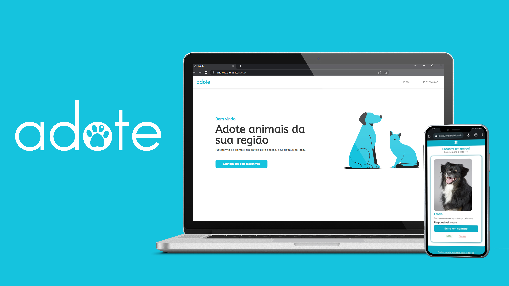

# Adote

> Plataforma de cadastro de animais domésticos para adoção.

## 📑 Sobre o projeto

Aplicação desenvolvida para praticar conhecimentos em programação web e as operações básicas com CRUD.
Create - Read - Update - Delete.

## 👩‍💻Desenvolvimento

O protótipo foi idealizado no figma.
Para esse projeto foi utilizado HTML, CSS e Javascript

## ⚙ Como funciona? 
Ao cadastrar um animal, o sistema apresenta as informações cadastradas que ficam armazenadas no local Storage do navegador.
A apresentação é feita em forma de slides pensada  para uso em dispositivos móveis, semelhante aos "Stories" presente em alguns aplicativos.
a
## 📝 Licença

Esse projeto está sob licença. Veja o arquivo [LICENÇA](LICENSE.md) para mais detalhes.

[⬆ Voltar ao topo](#nome-do-projeto) 

